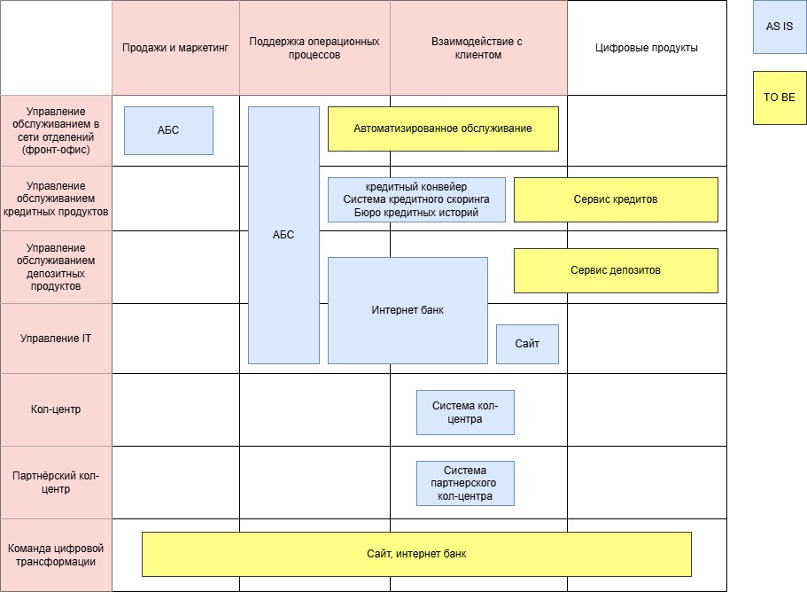
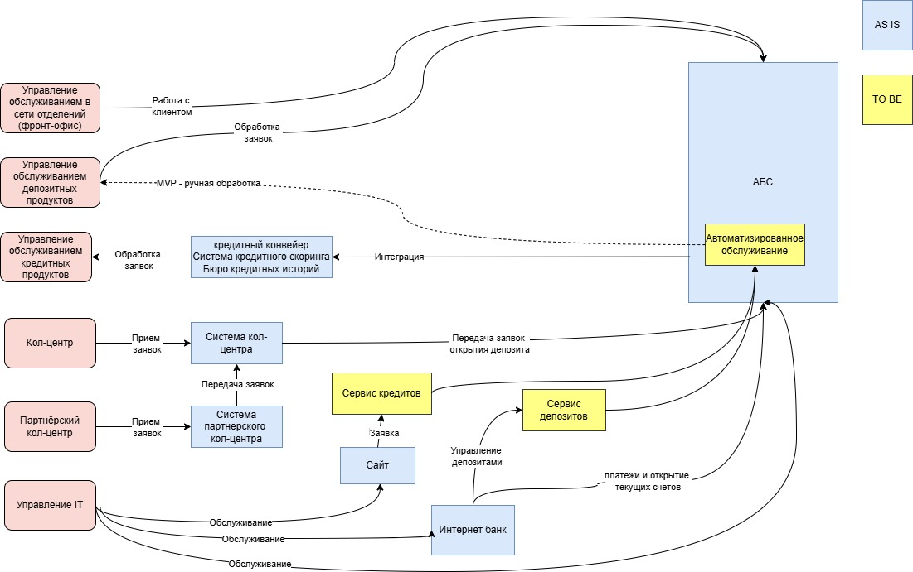
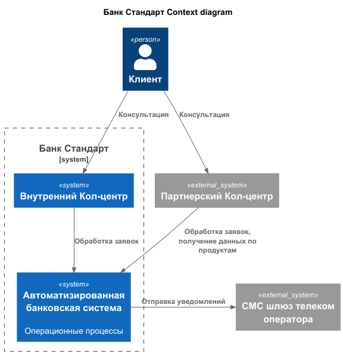
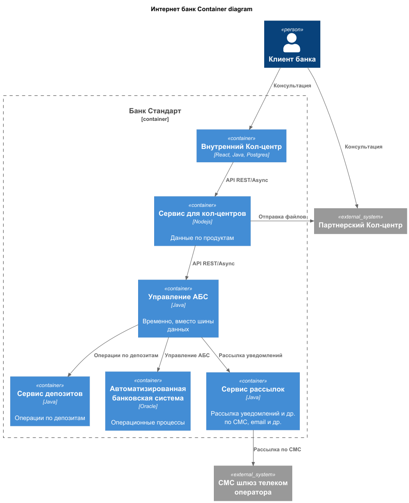
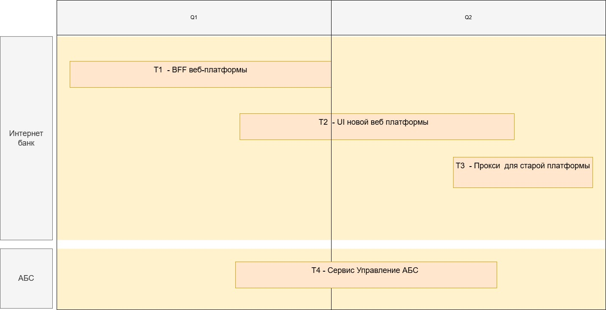
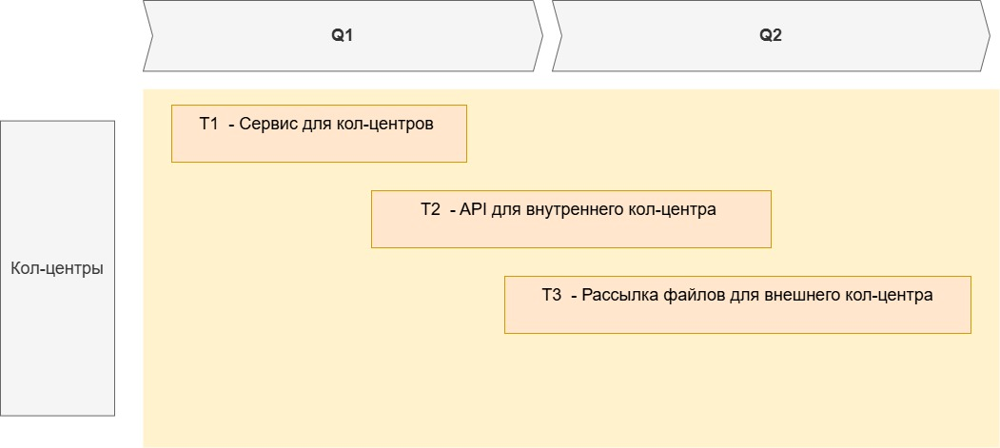
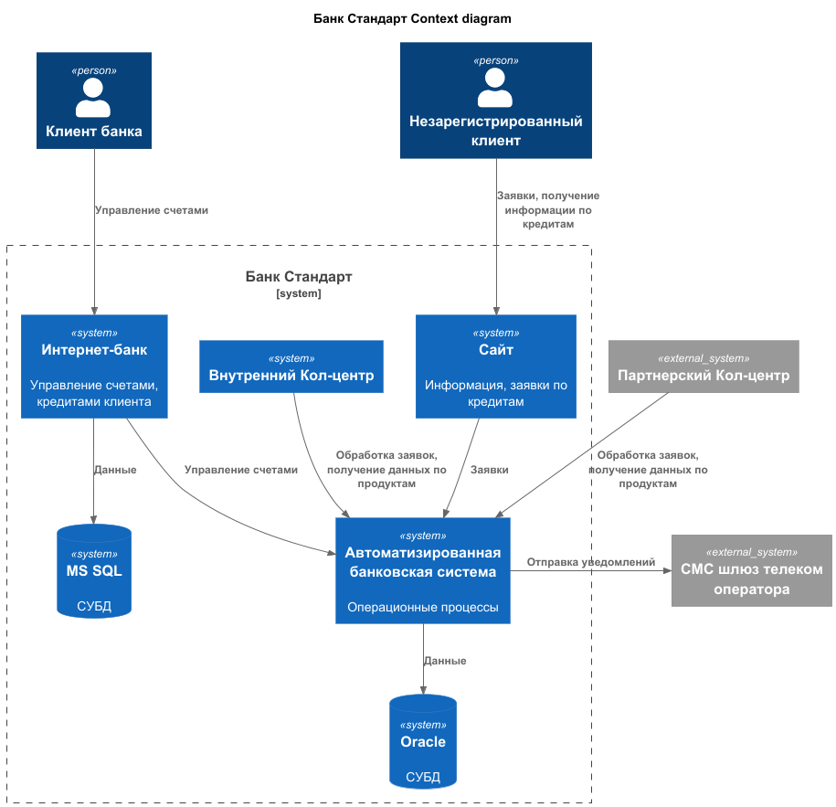
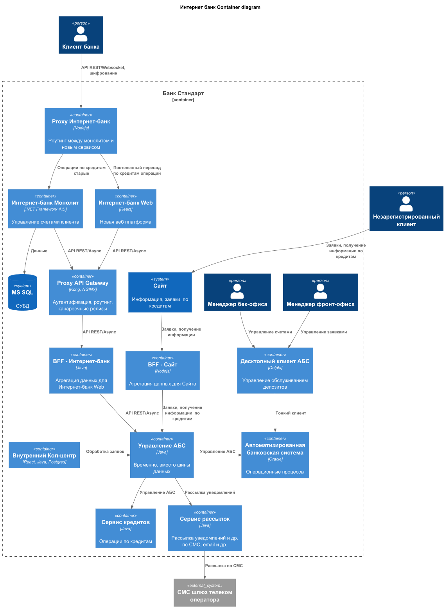

## Task 1
- Карта IT ландшафта
  - 

- Схема интеграции приложений
  - 

## Task 2
- Архитектурно значимые требования для Депозитов 
  - [FURPS+_deposit.md](Task2/FURPS%2B_deposit.md)

- Архитектурно значимые требования для Кредитов
  - [FURPS+_credit.md](Task2/FURPS%2B_credit.md)

## Task 3
- ADR открытие депозитов
  - [ADR_open_deposit.md](Task3/ADR_open_deposit.md)

- Диаграмма контекста
  - 
- Диаграмма контейнера
  - 
  
## Task 4
- ADR рассылка ставок
  - [ADR_shared_bets.md](Task4/ADR_shared_bets.md)
  
- Диаграмма контекста
  - 
- Диаграмма контейнера
  - 

- Задачи
  - депозиты
    - [Tasks_deposit.md](Task4/Tasks_deposit.md)
  - кол-центры
    - [Tasks_call_centre.md](Task4/Tasks_call_centre.md)

- роадмапы
  - 
  - 

## Task 5
- ADR заявка кредита
  - [ADR_apply_credit.md](Task5/ADR_apply_credit.md)

- Диаграмма контекста
  - 
- Диаграмма контейнера
  - 
