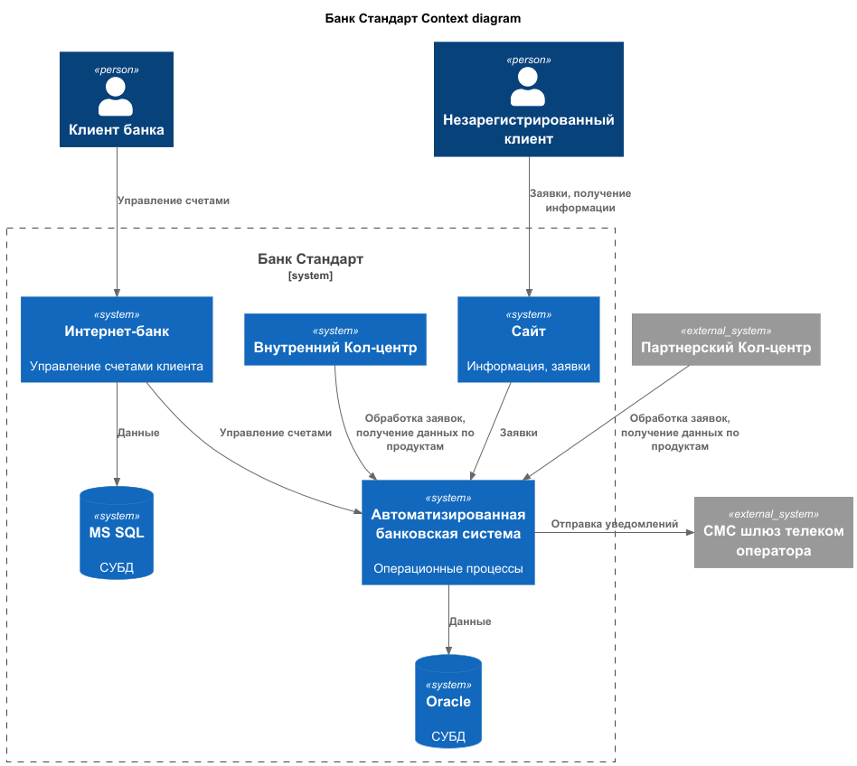
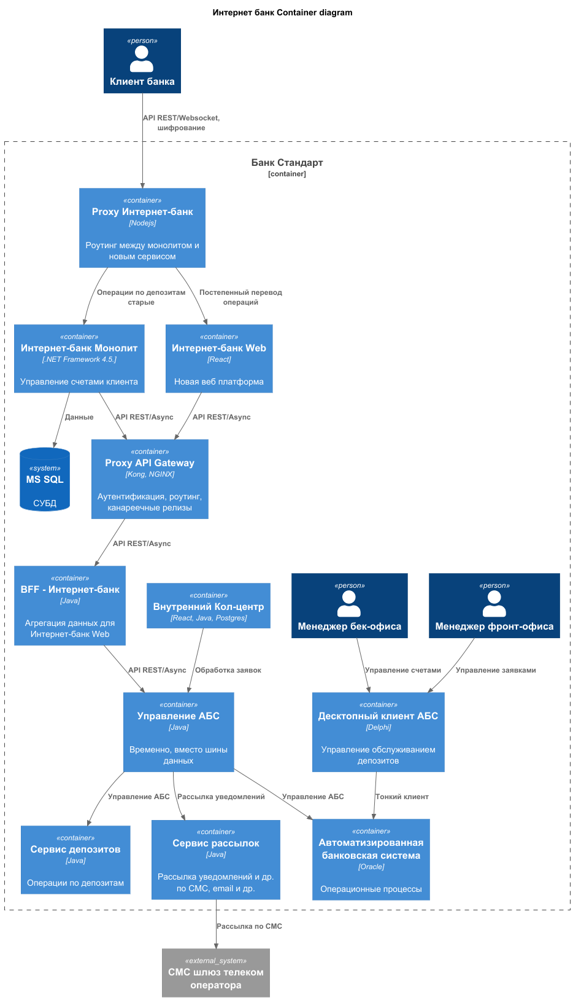

### **Название задачи: ADR открытие депозита** 
### **Автор: Антон Волков**
### **Дата: 25.10.2025**
### **Функциональные требования**

| **№** | **Действующие лица или системы** | **Use Case**      | **Описание**                                                                                                                                                                                                                                                                              |
|:-----:|:---------------------------------|:------------------|:------------------------------------------------------------------------------------------------------------------------------------------------------------------------------------------------------------------------------------------------------------------------------------------|
|  UC1  | Новый клиент, сайт               | Заявка депозита   | 1. Клиент переходит на сайт, открывается список депозитов с ставками  2. Заполянет свой телефон и ФИО и отправляет заявку  3. Менеджер кол-центра видит в своей системе заявку, связывается с клиентом для предложения особых условий и приглашения в отделение для идентификации |
|  UC2  | Клиент, интернет-банк            | Заявка депозита   | 1. Клиент при заходе в интернет-банк получает список актуальных депозитов со ставками.  2. Может подать заявку на октрытие депозита  3. При подаче получает подтверждение по СМС                                                                                                  |

### **Нефункциональные требования**
Опишите здесь нефункциональные требования и архитектурно значимые требования.

| **№** | **Требование**                                                                                             |
|:-----:|:-----------------------------------------------------------------------------------------------------------|
|   R   | Надёжность (Reliability)                                                                                   |                                                      |
|  R1   | Все данные, передаваемые с сайта, интернет-банка  необходимо шифровать                                     |                                                      |
|  R2   | Сайт и интернет-банк должны работать 24/7 и быть доступны в 99,9% случаев                                  |                                                      |
|   P   | Производительность (Performance)                                                                           |                                                      |
|  P1   | Отклик по всем операциям должен быть миллисекунды                                                          |                                                      |
|  +R   | + Ограничения (Restrictions)                                                                               |                                                      |
|  +R1  | Вести документацию систем для всех изменений                                                               |                                                      |

### **Решение**
- диаграмма контекста 
  - 

- диаграмма контейнеров
  - 

Интернет банк
  - оставляем текущий UI для старых клиентов (ибо пожилым будет легче пользоваться как было)
  - создаем новый UI для добавления новых задач 
    - под него свой BFF, чтобы в будущем по такому пути можно сделать мобильное приложение
  - в старом монолите делаем ссылки на новые функции, которые переключат клиента на новую платформу
    - прокси для BFF для каждой платформы (мобила в будущем)

АБС
  - сервис Управление (самописная шина данных, Kafka пока не доступна для платформы)
  - выносим операции по депозитам в отдельный сервис, общается с АБС через сервис Управления

### **Альтернативы**
- сразу переписать Интернет банк на новую платформу
  - есть риски оттока клиентов
  - риски наделать ошибок сразу во всех операциях
- доработать монолит под новые задачи и оставить доступ от него до АБС как было

**Недостатки, ограничения, риски**
- целых 2 прокси между монолитом и новой платформой
- самописная шина данных - отнимет время на разработку и нет гарантии безотказности
  - все таки Kafka уже законченное решение
- кол-центр, менеджеры бек/фронт офисов общаются напрямую с АБС

