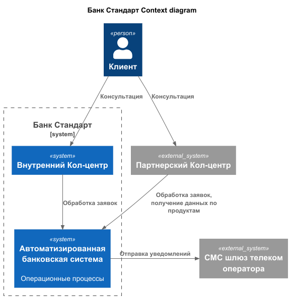
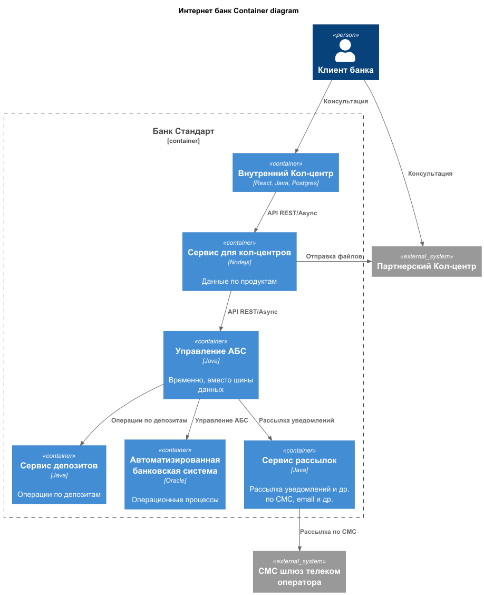

### **Название задачи: Предоставление ставки** 
### **Автор: Антон Волков**
### **Дата: 26.10.2025**
### **Функциональные требования**

| **№** | **Действующие лица или системы** | **Use Case**     | **Описание**                                                                                                                                                                                                                                                                 |
|:-----:|:---------------------------------|:-----------------|:-----------------------------------------------------------------------------------------------------------------------------------------------------------------------------------------------------------------------------------------------------------------------------|
|  UC1  | Внутренний кол-центр, АБС        | Передача ставки  | 1. Кол-центр предоставляет консультацию по депозитам  2. Обращается к системе АБС, получает текущие ставки по депозитам                                                                                                                                                  |
|  UC2  | Внешний кол-центр, АБС           | Передача ставки  | 1.  Кол-центр предоставляет консультацию по депозитам  2. Внешний кол-центр не может напрямую получить данные по ставкам по депозитам  3. Внутрення система банка высылает по расписанию 4 раза в день актуальные ставки в виде файлов во внешнюю систему кол-центра |

### **Нефункциональные требования**
Опишите здесь нефункциональные требования и архитектурно значимые требования.

| **№** | **Требование**                                                                                                                              |
|:-----:|:--------------------------------------------------------------------------------------------------------------------------------------------|
|   R   | Надёжность (Reliability)                                                                                                                    |  
|  R1   | Запросы на из внутренней системы кол-центра должны быть работать 24/7 и быть доступны в 99,9% случаев и отклик на получение менее 1 секунды |  
|  R1   | Отправка файлов во внешнюю систему не должна никак влиять на работу основных сервисов ни при сбое ни при нагрузке                           |  
|   P   | Производительность (Performance)                                                                                                            |  
|  P1   | Отклик по всем операциям должен быть миллисекунды                                                                                           |  
|  +R   | + Ограничения (Restrictions)                                                                                                                |  
|  +R1  | Отдельный сервис в системе АБС для нужд кол-центров (внутреннего и внешнего)                                                                |  

### **Решение**
- диаграмма контекста 
  - 

- диаграмма контейнеров
  - 

- отдельный сервис для работы с данными длч кол-центров
  - ограничение доступа, контроль данных
- кол-центры не имеют прямого доступа к АБС

### **Альтернативы**
- доработать внутренний кол-центр для "транзита" данных через него во внешние кол-центры
- напрямую из АБС отправлять одинаково и внутреннему и внешнему кол-центрам

**Недостатки, ограничения, риски**
- нет гарантии доставки файлов со ставками во внешнюю систему
- репутационные риски
    - неактуальные данные при отправке 4 раза в день
