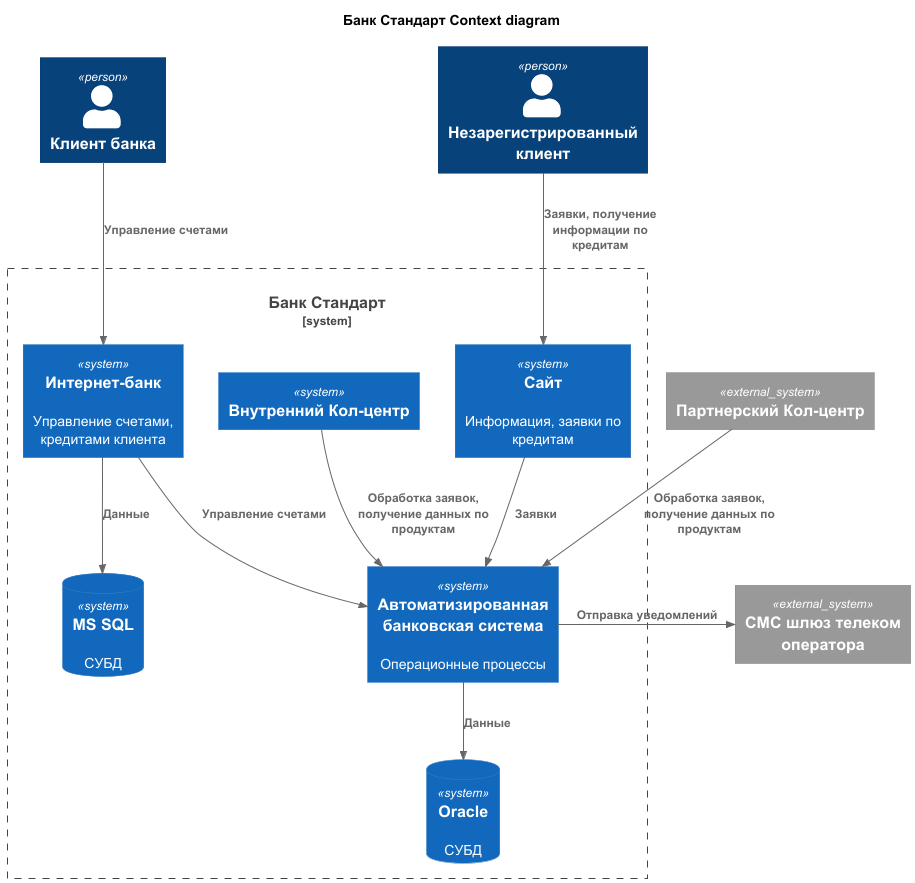
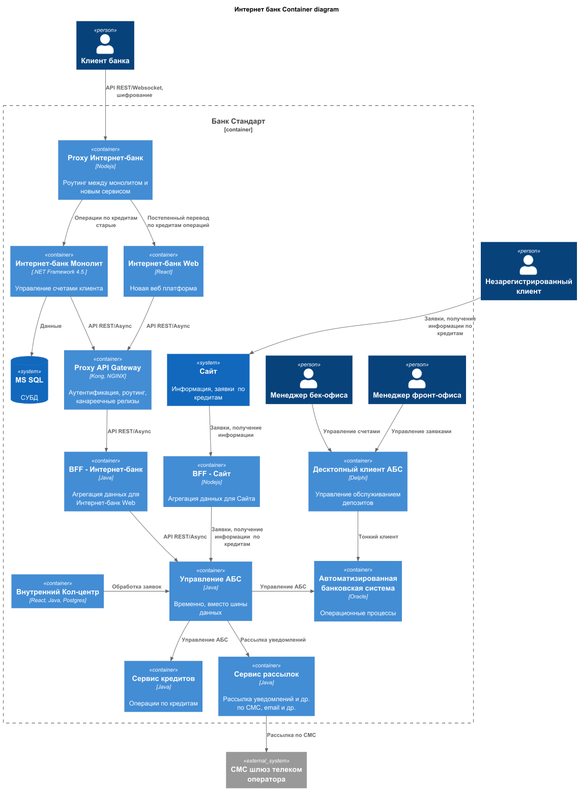

### **Название задачи: Заявка на кредит** 
### **Автор: Антон Волков**
### **Дата: 25.10.2025**
### **Функциональные требования**

| **№** | **Действующие лица или системы** | **Use Case**    | **Описание**                                                                                                                                                                                                                                     |
|:-----:|:---------------------------------|:----------------|:-------------------------------------------------------------------------------------------------------------------------------------------------------------------------------------------------------------------------------------------------|
|  UC1  | Новый клиент, сайт               | Заявка кредита  | 1. Клиент переходит на сайт, открывается страницу с кредитами   2. Заполняет заявку на кредит, указывая усвой телефон и ФИО и отправляет заявку  3. Системой рассылки отправляется уведомление для посещения отделения для идентификации |
|  UC2  | Клиент, интернет-банк            | Заявка кредита  | 1. Клиент переходит в интернет-банк на страницу кредитов   2.Заполняет заявку на кредит  3. Сразу получает СМС уведомление о решении о выдачи кредит и приглашение в отделение                                                           |
|  UC2  | Клиент, отделение банка          | Заявка кредита  | 1. Клиент обращается в отделение   2. Менеджер имеет доступ к заявкам кредитов клиента (если он уже подавал)                                                                                                                             |

### **Нефункциональные требования**
Опишите здесь нефункциональные требования и архитектурно значимые требования.

| **№** | **Требование**                                                                                             |
|:-----:|:-----------------------------------------------------------------------------------------------------------|
|   R   | Надёжность (Reliability)                                                                                   |                                                      |
|  R1   | Все данные, передаваемые с сайта, интернет-банка  необходимо шифровать                                     |                                                      |
|  R2   | Сайт и интернет-банк должны работать 24/7 и быть доступны в 99,9% случаев                                  |                                                      |
|   P   | Производительность (Performance)                                                                           |                                                      |
|  P1   | Отклик по всем операциям должен быть миллисекунды                                                          |                                                      |
|  +R   | + Ограничения (Restrictions)                                                                               |                                                      |
|  +R1  | Вести документацию систем для всех изменений                                                               |                                                      |

### **Решение**
- диаграмма контекста 
  - 

- диаграмма контейнеров
  - 

АБС
  - сервис Управление (самописная шина данных, Kafka пока не доступна для платформы)
  - выносим операции по кредитам в отдельный сервис, общается с АБС через сервис Управления

### **Альтернативы**
- ведение всех операционных действий кредиты, депозиты, заявки в интернет-банке
  - выделить операции дял незарегистрированных и клиентов банка
  - сайт как средство информации, рекламы банковских продуктов

**Недостатки, ограничения, риски**
- взятие кредита мошенниками, либо под давлением другого лица
- самописная шина данных - отнимет время на разработку и нет гарантии безотказности
  - все таки Kafka уже законченное решение

